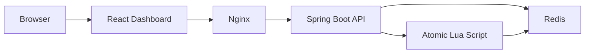

# API Rate Limiter

A production-oriented API rate limiting service built with **Java, Spring Boot, Redis, Lua, React, Docker, and Nginx**.

It provides atomic, per-IP request limiting with configurable rate limits, endpoint-level protection, HTTP 429 handling, real-time monitoring, and Docker-based deployment.

[](https://openjdk.java.net/)
[](https://spring.io/projects/spring-boot)
[](https://react.dev/)
[](https://redis.io/)
[](https://www.docker.com/)
[](https://github.com/soubhagya-behera/api-rate-limiter/actions)

---
## Features

- Redis-backed fixed-window rate limiting
- Atomic rate-limit decisions using Redis Lua scripting
- Per-IP request limiting
- Configurable global rate limits
- Endpoint-level rate-limit configuration with `@RateLimited`
- HTTP `429 Too Many Requests` responses
- `Retry-After` response header
- `X-RateLimit-Limit`, `X-RateLimit-Remaining`, and `X-RateLimit-Reset` headers
- Read-only rate-limit status endpoint
- Real-time React monitoring dashboard
- Redis health monitoring through Spring Boot Actuator
- OpenAPI / Swagger documentation
- Docker and Docker Compose support
- Render deployment configuration
- GitHub Actions CI

## Architecture



The rate limiter uses Redis to store request counters. The complete check-and-increment operation runs inside a single Lua script, making the rate-limit decision atomic even when multiple requests arrive concurrently.

---
## Tech Stack

| Category | Technologies |
| --- | --- |
| **Backend** | Java 17, Spring Boot 4.1.0, Spring Data Redis, Maven |
| **Rate Limiting** | Redis, Lua scripting |
| **Frontend** | React 19.2.8, Vite, JavaScript, CSS |
| **Web Server** | Nginx |
| **DevOps** | Docker, Docker Compose, Render |
| **CI/CD** | GitHub Actions |
| **API Documentation** | OpenAPI / Swagger |

## How It Works

1. A client sends a request to a protected API endpoint.
2. The Spring interceptor checks whether the endpoint has `@RateLimited` protection.
3. `RateLimiterService` executes the Redis Lua script.
4. The Lua script atomically checks and increments the client's request counter.
5. If the request is within the configured limit, the request continues normally.
6. If the limit has been reached, the request is rejected with HTTP `429 Too Many Requests`.
7. The response includes rate-limit information such as remaining requests and retry timing.

Rejected requests do not increment the counter or reset the existing window TTL.

---
## Configuration

The application supports environment-based configuration for rate limiting, Redis, CORS, and the server port.

| Variable | Description | Default |
| --- | --- | --- |
| `RATE_LIMIT_MAX_REQUESTS` | Maximum requests allowed per window | `5` |
| `RATE_LIMIT_WINDOW_SECONDS` | Rate-limit window duration in seconds | `60` |
| `RATE_LIMIT_KEY_PREFIX` | Redis key prefix for rate-limit counters | `rate-limit:ip` |
| `CORS_ALLOWED_ORIGINS` | Allowed frontend origins | `http://localhost:5173` |
| `SPRING_DATA_REDIS_HOST` | Redis hostname | `localhost` |
| `SPRING_DATA_REDIS_PORT` | Redis port | `6379` |
| `PORT` | Application HTTP port | `8080` |

For production deployments, configure environment-specific values through the deployment platform rather than hardcoding them in the source code.

## API Endpoints

| Method | Endpoint | Description |
| --- | --- | --- |
| `GET` | `/api/test` | Protected test endpoint used to demonstrate rate limiting |
| `GET` | `/api/rate-limit/status` | Returns the current rate-limit status without consuming a request |
| `GET` | `/api/demo` | Demonstrates endpoint-level rate-limit configuration |
| `GET` | `/actuator/health` | Application and Redis health status |
| `GET` | `/v3/api-docs` | OpenAPI specification |
| `GET` | `/swagger-ui/index.html` | Swagger UI |

### Rate-Limit Response

When the configured limit is exceeded, the protected endpoint returns:

```text
HTTP 429 Too Many Requests
```

The response includes rate-limit information such as:

- `Retry-After`
- `X-RateLimit-Limit`
- `X-RateLimit-Remaining`
- `X-RateLimit-Reset`

The `/api/rate-limit/status` endpoint is read-only and does not consume rate-limit requests.

---
## Endpoint-Level Rate Limiting

Endpoints can use the `@RateLimited` annotation to apply rate limiting.

Example:

```java
@RateLimited(maxRequests = 10, windowSeconds = 60)
@GetMapping("/api/demo")
public ResponseEntity<?> demo() {
    // endpoint logic
}
```

This allows different endpoints to have their own request limits while the global configuration remains available as the default.

## Dashboard

The React dashboard provides a real-time view of the rate limiter.

It displays:

- Backend connection status
- Current request limit
- Requests used in the current window
- Remaining requests
- Window reset countdown
- Current rate-limit status
- Manual test request controls
- Recent test request results

The dashboard periodically fetches rate-limit status information without consuming requests.

Protected test requests are sent only when the user clicks **Send Test Request**.

---
## Run Locally

### Prerequisites

Make sure the following are installed:

- Java 17
- Maven
- Node.js and npm
- Docker Desktop

### 1. Start Redis

From the project root:

```bash
docker compose up -d redis
```

### 2. Start the Backend

```bash
cd backend
mvn spring-boot:run
```

Backend:

```text
http://localhost:8080
```

### 3. Start the Frontend

Open another terminal:

```bash
cd frontend
npm install
npm run dev
```

Frontend:

```text
http://localhost:5173
```

### 4. Open the Dashboard

Visit:

```text
http://localhost:5173
```

The dashboard connects to the Spring Boot backend and displays the current rate-limit status.

## Docker

The complete application can also be run using Docker Compose.

From the project root:

```bash
docker compose up --build
```

This starts:

- React frontend
- Nginx
- Spring Boot backend
- Redis

Access the application at:

```text
Frontend: http://localhost:5173
Backend:  http://localhost:8080
```

To stop the services:

```bash
docker compose down
```

To rebuild the containers:

```bash
docker compose up --build
```

---
## Testing

### Backend Tests

Run the Spring Boot test suite:

```bash
cd backend
mvn test
```

The test suite covers rate-limit behavior, endpoint-level limits, HTTP responses, Redis integration, and concurrent requests.

### Frontend Build

Verify the production frontend build:

```bash
cd frontend
npm run build
```

### Docker Validation

From the project root:

```bash
docker compose config
```

Build and start the complete application:

```bash
docker compose up --build
```

## Deployment

The application is containerized and prepared for deployment using Docker and Render.

The deployment architecture consists of:

- React frontend served through Nginx
- Spring Boot backend
- Redis for rate-limit state
- Environment-based configuration
- Render Blueprint configuration
- GitHub Actions CI

The frontend communicates with the backend through the configured API URL, while the backend connects to Redis using environment variables.

### Production Configuration

Production values should be configured through the hosting platform.

Do not commit sensitive credentials or environment-specific secrets to the repository.

---

## Project Structure

```text
api-rate-limiter/
├── backend/
│   ├── Dockerfile
│   ├── .dockerignore
│   └── src/
├── frontend/
│   ├── Dockerfile
│   ├── .dockerignore
│   ├── nginx.conf.template
│   └── src/
├── .github/
│   └── workflows/
│       └── ci.yml
├── docker-compose.yml
├── render.yaml
└── README.md
```

## Author

**Soubhagya Kumar Behera**

GitHub: https://github.com/soubhagya-behera

Portfolio: https://soubhagya-portfolio-olive.vercel.app/